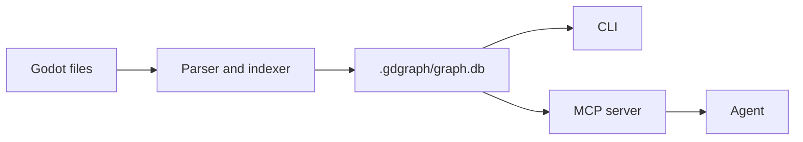

# Godot Agent Graph

[中文说明](README.md)

`gdgraph` is a local knowledge graph for Godot projects. It indexes scripts, scenes, resources, signals, autoloads, node paths, and static relationships into SQLite, then exposes that graph through a CLI and MCP tools for coding agents.

It turns a Godot project into a queryable graph so an agent can quickly find relevant modules, scene/resource links, and signal connections before reading source. This reduces repeated broad `grep`/file-scan loops and helps keep agent context focused on the files that matter.

## Install

Until an npm package is published, install the current public build from source.

You can also ask an Agent to install it for you. Send this to the Agent so it can install `gdgraph`, sync the Godot project index, and write MCP configuration:

```text
Fetch and follow instructions from https://raw.githubusercontent.com/biubiuHui/godot-agent-graph/master/AGENT_INSTALL.md
```

Requirements:

- Node.js 20 or newer
- npm

```bash
git clone https://github.com/biubiuHui/godot-agent-graph.git
cd godot-agent-graph
npm install
npm run build
npm install -g .
gdgraph version
```

After an npm release is available, install with `npm install -g godot-agent-graph` instead.

Update an existing local install:

```bash
git pull
npm install
npm run build
npm install -g .
```

## Index A Project

Pass the Godot project root, the directory that contains `project.godot`:

```bash
gdgraph sync /path/to/godot/project
```

The graph is stored at:

```text
/path/to/godot/project/.gdgraph/graph.db
```

Do not commit `.gdgraph/`.

Common maintenance commands:

```bash
gdgraph status /path/to/godot/project
gdgraph sync /path/to/godot/project
gdgraph sync /path/to/godot/project --rebuild
gdgraph clean /path/to/godot/project
```

`sync` is the normal create/update command. Use `sync --rebuild` when you need to discard the existing graph and index the project from scratch. Use `clean` only when you want to remove `.gdgraph` without rebuilding it.

## Connect An Agent

Write MCP configuration for supported local agents:

```bash
gdgraph install /path/to/godot/project
```

Supported targets:

- Codex
- Claude Code
- Cursor
- opencode
- Gemini
- Kiro

Install one target only:

```bash
gdgraph install /path/to/godot/project --target codex
```

For Codex, the default install writes MCP config plus a managed `AGENTS.md` instruction block. To also install the optional global Codex skill into `~/.codex/skills`, pass `--with-skill`:

```bash
gdgraph install /path/to/godot/project --target codex --with-skill
```

Restart the agent after installation. The generated MCP server command is usually:

```bash
gdgraph serve --mcp /path/to/godot/project
```

## MCP Tools

The default MCP surface is small on purpose:

| Tool | Purpose |
| --- | --- |
| `godot_context` | First call for structure, references, flow, and edit planning. |
| `godot_node` | Read indexed source for one file, symbol, or graph node id. |
| `godot_status` | Check graph state and freshness. |
| `godot_sync` | Refresh the graph when it may be stale. |

Recommended agent flow:

1. Call `godot_context`.
2. If source is needed, pass the returned `graphId` to `godot_node`.
3. If `initialized` is `false` or `indexEmpty` is `true`, call `godot_sync` manually once, then retry `godot_context`.
4. If `indexFresh` is `false`, call `godot_sync`.

Write `godot_context.query` as a short keyword and identifier query, not a natural-language task. Prefer exact class names, methods, constants, fields, resource paths, file/path fragments, and domain nouns.

For resource-heavy questions, include path fragments such as `resources/definitions` plus `.tres` property names or string values. Resource metadata participates in graph search, but `godot_context` is still a bounded navigation result, not a complete resource audit.

Good:

```text
enemy_spawner spawn_wave WaveConfig export EnemyDefinition spawn_weight scene_path
```

Avoid:

```text
Find enemy spawning systems and wave config resources relevant for writing a design. Include paths and summary.
```

Do not use broad `grep`, glob, or raw file-reading loops to rebuild structure that is already indexed. Raw reads are still useful for unindexed files, files reported as stale, and external validation such as tests or compiler output.

## Suggested `AGENTS.md`

```markdown
## Godot Graph Navigation

This project uses `gdgraph` for indexed Godot structure.

- For Godot scripts, scenes, resources, signals, autoloads, node paths, or call chains, call `godot_context` before broad file search.
- For `godot_context.query`, use terse identifier-heavy keyword queries: exact class names, method names, constants, fields, resource paths, file/path fragments, and domain nouns.
- For `.tres` resource queries, include path fragments and exported/resource property names or string values; treat results as navigation, not exhaustive inventory.
- Do not write natural-language task instructions in `godot_context.query`, such as "find", "include paths", "summarize", "relevant for", or "tell me".
- Use `godot_node` to read indexed Godot source for a file, symbol, or graph node id.
- Use `godot_status` to check graph freshness.
- If `initialized` is false or `indexEmpty` is true, call `godot_sync` once before graph queries.
- If `indexFresh` is false, call `godot_sync` or run `gdgraph sync <project>`.
- Do not rebuild indexed Godot structure with broad `grep`, glob, or raw file-reading loops.
- Directly read raw files only when a file is unindexed, listed as stale, or needed for external validation.
- Treat `godot_context.truncated` and `godot_node.notes.omitted` as bounded navigation output, not exhaustive proof. For constants, enums, signal names, resource paths, or string protocols, add a narrow `rg` or test check.
- If MCP tools are unavailable, use the `gdgraph` CLI first, then read the few source files it identifies.
```

## CLI Examples

```bash
gdgraph sync /path/to/godot/project
gdgraph context FixtureActor --path /path/to/godot/project
gdgraph node --path /path/to/godot/project --symbol FixtureActor
gdgraph node --path /path/to/godot/project --file res://scripts/fixture_actor.gd --limit 80
```

## Indexed Data

`gdgraph` reads:

- `project.godot`
- `.gd`
- `.tscn`
- `.tres`

It records:

- project metadata, main scene, autoloads, and input actions;
- scenes and scene nodes;
- script classes, methods, properties, and signals;
- resources, resource properties, and script attachments;
- scene instancing;
- node-path references;
- statically resolvable calls and signal connections.

It skips generated and external directories such as `.git/`, `.godot/`, `.import/`, `.gdgraph/`, `addons/`, `demo/`, `dist/`, and `node_modules/`.

## How It Works



`gdgraph sync` is incremental after the first index: it updates changed Godot files, removes deleted file records, and recomputes resolver-owned relationships without rewriting unchanged indexed files. `gdgraph sync --rebuild` removes `.gdgraph` first, then performs a fresh full index. Sync output reports change counts and omits path lists by default to keep CLI and agent context compact.

`gdgraph serve --mcp` runs a catch-up sync on startup when possible. While the MCP server is running, the watcher records Godot file changes and debounces the same incremental sync path. If the watcher is disabled or degraded, tool responses report stale or pending files so the agent can call `godot_sync` or `gdgraph sync` before relying on the graph.

## Limits

`gdgraph` is static analysis. It does not run the Godot project.

`parseErrors` are gdgraph parser/extractor errors only. `parseErrorScope: "gdgraph_static_parse"` and `compilerChecked: false` mean Godot compiler/editor import validation still requires running Godot or project tests separately.

It avoids guessing runtime-only behavior such as dynamic node creation, complex type flow, or string-built paths. Unresolved references stay visible instead of being turned into false edges.

## Development

```bash
npm install
npm test
npm run build
npm run gdgraph -- version
```

Try the minimal fixture:

```bash
npm run gdgraph -- sync tests/fixtures/godot/minimal
npm run gdgraph -- context FixtureActor --path tests/fixtures/godot/minimal
```

Run the privacy check:

```bash
npm run privacy:check
```

## Reference

- [CLI Reference](docs/reference/cli.md)
- [MCP Tools Reference](docs/reference/mcp.md)
- [Agent Output Reference](docs/reference/agent-output.md)
- [Installer Reference](docs/reference/install.md)
- [Privacy And Release Guardrails](docs/reference/privacy.md)
- [Architecture](docs/reference/architecture.md)
- [Troubleshooting](docs/reference/troubleshooting.md)
- [Minimal Fixture Walkthrough](examples/minimal-walkthrough.md)
