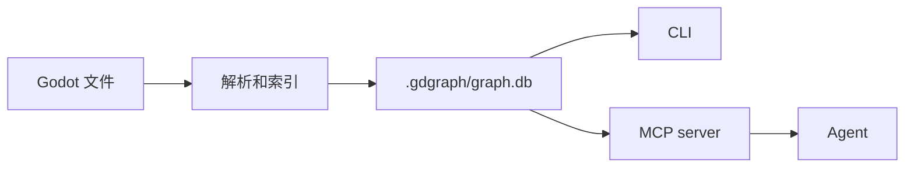

# Godot Agent Graph

[English README](README.en.md)

`gdgraph` 是给 Godot 项目用的本地知识图谱工具。它会索引脚本、场景、资源、信号、autoload、节点路径和静态关系，写入 SQLite，并通过 CLI 和 MCP 工具提供给编程 Agent。

它会把 Godot 工程构建成可查询的图谱，让 Agent 在读源码前快速定位相关模块、场景/资源链接和信号连接关系。这样可以减少反复大范围 `grep` 或遍历文件造成的上下文浪费，让 Agent 把注意力集中在真正相关的文件上。

## 安装

在 npm 包发布前，当前公开版本从源码安装。

也可以让 Agent 自动安装：把下面这句话发给你的 Agent，让它按说明安装 `gdgraph`、同步 Godot 项目索引并写入 MCP 配置：

```text
Fetch and follow instructions from https://raw.githubusercontent.com/biubiuHui/godot-agent-graph/master/AGENT_INSTALL.md
```

要求：

- Node.js 20 或更高版本
- npm

```bash
git clone https://github.com/biubiuHui/godot-agent-graph.git
cd godot-agent-graph
npm install
npm run build
npm install -g .
gdgraph version
```

npm 版本发布后，可以改用 `npm install -g godot-agent-graph` 安装。

更新本地版本：

```bash
git pull
npm install
npm run build
npm install -g .
```

如果更新包含图谱/索引契约变化，更新工具后对每个 Godot 项目重新生成本地图谱：

```bash
gdgraph clean /path/to/godot/project
gdgraph sync /path/to/godot/project
```

## 索引项目

传入 Godot 项目根目录，也就是包含 `project.godot` 的目录：

```bash
gdgraph sync /path/to/godot/project
```

图谱保存在：

```text
/path/to/godot/project/.gdgraph/graph.db
```

不要提交 `.gdgraph/`。

常用维护命令：

```bash
gdgraph status /path/to/godot/project
gdgraph sync /path/to/godot/project
gdgraph sync /path/to/godot/project --rebuild
gdgraph clean /path/to/godot/project
```

`sync` 是正常创建/更新图谱的命令。需要丢弃旧图并从头索引时使用 `sync --rebuild`。`clean` 只用于删除 `.gdgraph`，不会重新建图。

## 接入 Agent

写入本地 Agent 的 MCP 配置：

```bash
gdgraph install /path/to/godot/project
```

支持的目标：

- Codex
- Claude Code
- Cursor
- opencode
- Gemini
- Kiro

只写入一个目标：

```bash
gdgraph install /path/to/godot/project --target codex
```

对 Codex 来说，默认安装会写入 MCP 配置和受管理的 `AGENTS.md` 指令块。若还想把可选的全局 Codex skill 安装到 `~/.codex/skills`，使用 `--with-skill`：

```bash
gdgraph install /path/to/godot/project --target codex --with-skill
```

安装后重启 Agent。生成的 MCP server 命令通常是：

```bash
gdgraph serve --mcp /path/to/godot/project
```

## MCP 工具

默认只暴露四个工具：

| 工具 | 用途 |
| --- | --- |
| `godot_context` | 第一入口。查结构、引用、流程和改动范围。 |
| `godot_node` | 读取一个已索引文件、符号或图节点的源码。 |
| `godot_status` | 查看图谱状态和新鲜度。 |
| `godot_sync` | 图谱可能落后文件时同步。 |

推荐顺序：

1. 先用 `godot_context`。
2. 需要源码时，从 `context.paths[pN]` 取文件路径，再用节点的 `name` / `qname` 调用 `godot_node({ file, symbol })`。
3. 如果 `initialized` 是 `false` 或 `indexEmpty` 是 `true`，先手动调用一次 `godot_sync`，再重试 `godot_context`。
4. 如果 `indexFresh` 是 `false`，先用 `godot_status` 看完整 pending 文件列表，或直接调用 `godot_sync`。

只想读一个源码片段时，对 `godot_node` 传 `includeNotes: false`，避免关系摘要挤占上下文。

`paths`、`selectors` 和紧凑 `nN` 节点 id 只会从预算后的可见输出生成；被 `omitted` 裁掉的节点、关系、片段和 note-only 路径不会留下多余 alias。

`godot_context.query` 应写成短关键词/符号查询，不要写成自然语言任务。优先使用准确类名、方法名、常量名、字段名、资源路径、文件/路径片段和领域名词。

`godot_context` 会返回 `strategy` 和 `completeness`。它们用于判断这次结果是资源优先、符号优先、关系摘要、源码窗口还是通用导航；`completeness.complete: false` 表示这是有边界的导航结果，不是完整证明链。

`godot_node` 的关系摘要使用 `notes.complete` 和 `notes.omitted` 表示完整性。只读源码片段时传 `includeNotes: false`，避免关系摘要占用上下文。

查询资源时，建议带上 `resources/definitions` 这类路径片段，以及 `.tres` 中的属性名或字符串值。资源 metadata 会参与图谱搜索，但 `godot_context` 仍然是有边界的导航结果，不是完整资源审计。

推荐：

```text
enemy_spawner spawn_wave WaveConfig export EnemyDefinition spawn_weight scene_path
```

避免：

```text
Find enemy spawning systems and wave config resources relevant for writing a design. Include paths and summary.
```

不要用大范围 `grep`、glob 或原始文件遍历去重建图谱已经索引的结构。只有文件未索引、工具提示 stale，或需要测试和编译器输出时，才直接读原始文件。

## 建议写进 AGENTS.md

```markdown
## Godot Graph Navigation

This project uses `gdgraph` for indexed Godot structure.

- For Godot scripts, scenes, resources, signals, node paths, or call chains, use the `godot-graph-navigation` skill when available.
- If the skill is unavailable, call `godot_context` before broad file search, then use `godot_node` for indexed source reads.
- For focused source slices, pass `includeNotes: false` to `godot_node` unless relationship notes are needed.
- Treat `strategy`, `completeness`, `notes.complete`, and `notes.omitted` as bounded-output signals, not proof unless complete.
- If the graph is missing or stale, run `godot_sync` or `gdgraph sync <project>`.
```

## CLI 示例

```bash
gdgraph sync /path/to/godot/project
gdgraph context FixtureActor --path /path/to/godot/project
gdgraph node --path /path/to/godot/project --symbol FixtureActor
gdgraph node --path /path/to/godot/project --file res://scripts/fixture_actor.gd --limit 80
gdgraph node --path /path/to/godot/project --file res://scripts/fixture_actor.gd --limit 80 --no-notes
```

## 索引内容

会读取：

- `project.godot`
- `.gd`
- `.tscn`
- `.tres`

会记录：

- 项目元数据、主场景、autoload、input action；
- 场景和场景节点；
- 脚本类、方法、属性、信号；
- 资源、资源属性和脚本挂载；
- 场景实例关系；
- 节点路径引用；
- 能静态解析的方法调用和信号连接。

会跳过生成目录和外部目录，例如 `.git/`、`.godot/`、`.import/`、`.gdgraph/`、`addons/`、`demo/`、`dist/`、`node_modules/`。

## 工作方式



第一次索引之后，`gdgraph sync` 是增量同步：它更新变化过的 Godot 文件、移除已删除文件的图谱记录，并重新计算 resolver 生成的关系，不会重写未变化的已索引文件。`gdgraph sync --rebuild` 会先删除 `.gdgraph`，再进行一次全量新索引。同步输出只报告变化数量，默认省略路径列表和本地数据库路径，避免浪费 CLI 和 agent 上下文。

`gdgraph serve --mcp` 启动时会尽量先同步索引。MCP server 运行期间，watcher 会记录 Godot 文件变化，并用防抖方式触发同一条增量同步路径。如果 watcher 被禁用或降级，图谱查询会返回 compact stale 信息；需要完整 pending 文件列表时用 `godot_status`，然后再调用 `godot_sync` 或 `gdgraph sync`。

启动同步、watcher 同步和手动同步在同一进程里碰撞时，会返回紧凑的 graph-write 重试信息；跨进程写入仍由本地图谱锁保护。

## 边界

`gdgraph` 只做静态分析，不运行 Godot 项目。

`parseErrors` 只表示 gdgraph 自己的静态解析/抽取错误。同步输出会返回 `parseErrorCount`，最多列出前 10 条 `parseErrors`，并用 `parseErrorsOmitted` 标明省略数量。`parseErrorScope: "gdgraph_static_parse"` 和 `compilerChecked: false` 表示尚未经过 Godot 编译器或编辑器导入验证；这仍然需要单独运行 Godot 或项目测试。

它不会猜运行时动态创建的节点、复杂类型流或字符串拼接路径。无法确认的引用会保留为 unresolved，避免生成错误边。

## 开发

```bash
npm install
npm test
npm run build
npm run gdgraph -- version
```

用最小 fixture 试跑：

```bash
npm run gdgraph -- sync tests/fixtures/godot/minimal
npm run gdgraph -- context FixtureActor --path tests/fixtures/godot/minimal
```

## 参考文档

- [CLI Reference](docs/reference/cli.md)
- [MCP Tools Reference](docs/reference/mcp.md)
- [Agent Output Reference](docs/reference/agent-output.md)
- [Installer Reference](docs/reference/install.md)
- [Architecture](docs/reference/architecture.md)
- [Troubleshooting](docs/reference/troubleshooting.md)
- [Minimal Fixture Walkthrough](examples/minimal-walkthrough.md)
