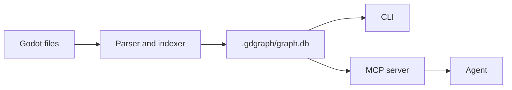

# Godot Agent Graph

[中文说明](README.zh-CN.md)

`gdgraph` is a local knowledge graph for Godot projects. It indexes scripts, scenes, resources, signals, autoloads, node paths, and static relationships into SQLite, then exposes that graph through a CLI and MCP tools for coding agents.

Use it when an agent needs to understand a Godot project before editing. The agent can ask the graph for the relevant structure, then read only the source files that matter.

## Install

The current public build is installed from source.

Requirements:

- Node.js 20 or newer
- npm

```bash
git clone https://github.com/biubiuHui/godot-agent-graph.git
cd godot-agent-graph
npm install
npm run build
npm install -g .
gdgraph version
```

Update an existing local install:

```bash
git pull
npm install
npm run build
npm install -g .
```

## Index A Project

Pass the Godot project root, the directory that contains `project.godot`:

```bash
gdgraph init /path/to/godot/project
```

The graph is stored at:

```text
/path/to/godot/project/.gdgraph/graph.db
```

Do not commit `.gdgraph/`.

Common maintenance commands:

```bash
gdgraph status /path/to/godot/project
gdgraph sync /path/to/godot/project
gdgraph rebuild /path/to/godot/project
gdgraph clean /path/to/godot/project
```

## Connect An Agent

Write MCP configuration for supported local agents:

```bash
gdgraph install /path/to/godot/project
```

Supported targets:

- Codex
- Claude Code
- Cursor
- opencode
- Gemini
- Kiro

Install one target only:

```bash
gdgraph install /path/to/godot/project --target codex
```

Restart the agent after installation. The generated MCP server command is usually:

```bash
gdgraph serve --mcp /path/to/godot/project
```

## MCP Tools

The default MCP surface is small on purpose:

| Tool | Purpose |
| --- | --- |
| `godot_context` | First call for structure, references, flow, and edit planning. |
| `godot_node` | Read indexed source for one file, symbol, or graph node id. |
| `godot_status` | Check graph state and freshness. |
| `godot_sync` | Refresh the graph when it may be stale. |

Recommended agent flow:

1. Call `godot_context`.
2. If source is needed, pass the returned `graphId` to `godot_node`.
3. If `initialized` is `false` or `indexEmpty` is `true`, call `godot_sync` manually once, then retry `godot_context`.
4. If `indexFresh` is `false`, call `godot_sync`.

Do not use broad `grep`, glob, or raw file-reading loops to rebuild structure that is already indexed. Raw reads are still useful for unindexed files, files reported as stale, and external validation such as tests or compiler output.

Compatibility handlers still exist for CLI parity and debugging: `godot_search`, `godot_scene`, `godot_explore`, `godot_symbol`, `godot_callers`, `godot_callees`, `godot_impact`, and `godot_project_map`.

## Suggested `AGENTS.md`

```markdown
## Godot Graph Navigation

This project uses `gdgraph` for indexed Godot structure.

- For Godot scripts, scenes, resources, signals, autoloads, node paths, or call chains, call `godot_context` before broad file search.
- Use `godot_node` to read indexed Godot source for a file, symbol, or graph node id.
- Use `godot_status` to check graph freshness.
- If `initialized` is false or `indexEmpty` is true, call `godot_sync` once before graph queries.
- If `indexFresh` is false, call `godot_sync` or run `gdgraph sync <project>`.
- Do not rebuild indexed Godot structure with broad `grep`, glob, or raw file-reading loops.
- Directly read raw files only when a file is unindexed, listed as stale, or needed for external validation.
- If MCP tools are unavailable, use the `gdgraph` CLI first, then read the few source files it identifies.
```

## CLI Examples

```bash
gdgraph search FixtureActor --path /path/to/godot/project
gdgraph scene res://fixture_main.tscn --path /path/to/godot/project
gdgraph explore FixtureActor --path /path/to/godot/project
gdgraph callers apply_damage --path /path/to/godot/project
gdgraph callees FixtureActor --path /path/to/godot/project
gdgraph impact res://scripts/fixture_actor.gd --path /path/to/godot/project
```

## Indexed Data

`gdgraph` reads:

- `project.godot`
- `.gd`
- `.tscn`
- `.tres`

It records:

- project metadata, main scene, autoloads, and input actions;
- scenes and scene nodes;
- script classes, methods, properties, and signals;
- resources and script attachments;
- scene instancing;
- node-path references;
- statically resolvable calls and signal connections.

It skips generated and external directories such as `.git/`, `.godot/`, `.import/`, `.gdgraph/`, `addons/`, `demo/`, `dist/`, and `node_modules/`.

## How It Works



`gdgraph serve --mcp` runs a catch-up sync on startup when possible. If the graph may lag behind disk, tool responses report stale or pending files.

## Limits

`gdgraph` is static analysis. It does not run the Godot project.

It avoids guessing runtime-only behavior such as dynamic node creation, complex type flow, or string-built paths. Unresolved references stay visible instead of being turned into false edges.

## Development

```bash
npm install
npm test
npm run build
npm run gdgraph -- version
```

Try the minimal fixture:

```bash
npm run gdgraph -- init tests/fixtures/godot/minimal
npm run gdgraph -- explore FixtureActor --path tests/fixtures/godot/minimal
```

Run the privacy check:

```bash
npm run privacy:check
```

## Reference

- [CLI Reference](docs/reference/cli.md)
- [MCP Tools Reference](docs/reference/mcp.md)
- [Agent Output Reference](docs/reference/agent-output.md)
- [Installer Reference](docs/reference/install.md)
- [Privacy And Release Guardrails](docs/reference/privacy.md)
- [Architecture](docs/reference/architecture.md)
- [Troubleshooting](docs/reference/troubleshooting.md)
- [Minimal Fixture Walkthrough](examples/minimal-walkthrough.md)
