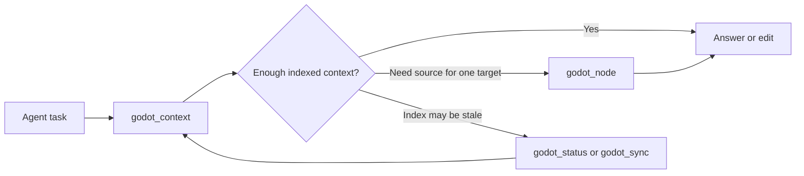

# Agent Output Reference

This document describes the compact graph output used by the MCP tools. It is for maintainers and agents that need to understand how `gdgraph` returns indexed Godot context without falling back to broad file scans.

## System Overview

`gdgraph` indexes Godot scripts, scenes, resources, signals, node paths, and graph relationships before an agent asks a question. The MCP surface then returns compact, ranked context that is meant to be read directly by an agent.

The intended flow is:



Broad `grep` or raw file reads are not the default path for indexed Godot files. They are reserved for unindexed files, stale files named by the response, and external validation such as tests or compiler output.

## Directory Structure

The agent-facing output is implemented in these modules:

| Path | Responsibility |
| --- | --- |
| `src/context/explore.ts` | Selects ranked `godot_context` facts from search, graph neighbors, source snippets, path links, and optional blast-radius data. It does not create compact aliases. |
| `src/context/node-payload.ts` | Locates exact `godot_node` targets and source windows for files, symbols, and graph node ids. It does not own compact path or node references. |
| `src/context/output-view.ts` | Converts selected context or node-read facts into the shared `AgentOutputView`. |
| `src/context/output-budget.ts` | Applies count and character budgets to the view before compact references exist. |
| `src/context/output-finalize.ts` | Builds `paths`, `prefixes`, compact node ids, selectors, relationship endpoints, and output invariants from the budgeted visible view. |
| `src/context/agent-output.ts` | Compatibility facade for `formatAgentContext()`. |
| `src/mcp/tools.ts` | Defines the MCP surface and adapts status, context, node, and sync payloads to compact JSON. |
| `src/db/queries.ts` | Provides graph node/file lookup, search token handling, relationship rows, and symbol-reference data. |

Public fixtures and temporary synthetic projects are used for tests. Documentation and tests must not copy private project code, private project names, absolute local paths, or private Godot assets.

## Tool Surface

The default MCP tools are intentionally small:

| Tool | Purpose |
| --- | --- |
| `godot_status` | Returns graph initialization, counts, and freshness health. |
| `godot_context` | Primary first call for understanding, locating, flow tracing, and edit planning. |
| `godot_node` | Graph-backed source read for one indexed file, symbol, or graph node id. |
| `godot_sync` | Manual recovery when the index needs to catch up. |

## Compact Context Format

`formatAgentContext()` returns a bounded context object:

```json
{
  "query": "FixtureActor",
  "strategy": "symbol-first",
  "completeness": { "scope": "bounded_navigation", "complete": false },
  "prefixes": { "@p1": "res://scripts/ui/" },
  "paths": { "p1": "@p1/fixture_actor.gd" },
  "entryPoints": ["n1"],
  "pathsBetween": [
    { "from": "n1", "kind": "calls", "to": "n2", "provenance": "resolver" }
  ],
  "nodes": [
    {
      "id": "n1",
      "kind": "script_class",
      "name": "FixtureActor",
      "path": "p1",
      "line": 2
    }
  ],
  "selectors": {
    "n2": { "kind": "scene_node", "path": "p2", "suffix": "Main/FixtureActor" }
  },
  "relationships": [],
  "snippets": [
    { "path": "p1", "start": 2, "end": 18, "text": "..." }
  ],
  "truncated": false,
  "omitted": { "nodes": 0, "relationships": 0, "snippets": 0 },
  "budget": { "maxChars": 4800, "estimatedChars": 1200 }
}
```

`paths` stores each returned Godot path once. Nodes, snippets, blast-radius check files, and scene summaries refer back to these short ids. When several paths share a long directory prefix, `prefixes` can replace that shared prefix with an alias such as `@p1`.

Compact references are finalized only after selection and budgeting. A node, snippet, relationship endpoint, stale file, or selector that is not visible in the final payload cannot contribute a `paths`, `prefixes`, or `selectors` entry.

`id` is a response-local compact node id. For follow-up source reads, expand the node `path` through `paths[pN]` and call `godot_node` with `file` plus `symbol` from the node `name` or `qname`. `selectors` appears only for nodes that cannot be identified cleanly by `file + symbol`; when needed, rebuild the raw graph id from the selector parts or use its explicit `id`.

`strategy` records the fixed internal query strategy that ranked the response. Current values are `resource-first`, `symbol-first`, `relationship`, `source-oriented`, and `general`. This is an interpretation aid, not a personalization or output mode.

`completeness` describes the scope of the returned package. `complete:false` means the response is useful navigation, not exhaustive proof; ask a narrower graph question, use `godot_node`, run a narrow `rg`, or run tests when complete coverage matters.

## Relationship Format

Relationships are structured objects rather than repeated prose strings:

```json
{ "from": "n1", "kind": "calls", "to": "n2", "provenance": "resolver" }
```

When either side of an edge is outside the visible node set, the formatter still uses a compact local node id and adds a compact `selectors[nN]` entry when a graph-id selector is needed. It does not return raw `graphFrom` or `graphTo` ids by default. Unresolved references keep `target` for plain names; unresolved resource paths use `targetPath` so the long `res://...` value stays in `paths`.

`references_symbol` means a source node names or reads a target symbol. It is separate from `calls` and should not be treated as executable flow.

## Source Reads

`godot_context` can include snippets, but it is optimized for orientation and edit planning. Use `godot_node` when source for one target is needed.

Write `godot_context.query` as a short keyword and identifier string. Prefer exact class names, method names, constants, fields, resource paths, file/path fragments, and domain nouns. Avoid natural-language task wording such as `find`, `include paths`, `summarize`, `relevant for`, or `tell me`.

Resource nodes include `.tres` property metadata. For resource-heavy tasks, query with path fragments and concrete property names or literal values. Treat returned resource matches as ranked navigation evidence, not proof that every matching resource has been listed.

`godot_node` supports three target modes:

```json
{ "file": "res://scripts/fixture_actor.gd", "offset": 1, "limit": 80 }
```

```json
{ "symbol": "FixtureActor" }
```

```json
{ "id": "script:res://scripts/fixture_actor.gd" }
```

File reads return a bounded line window. Symbol and graph-node reads prefer indexed `startLine` and `endLine`, so method and class queries return relevant source instead of the start of a file. `symbolsOnly: true` returns structure without source text. `includeCode: false` keeps metadata and relationship notes while omitting source. `includeNotes: false` keeps the target/source payload and omits relationship notes for focused source reads. Relationship notes are bounded; use `notes.complete` and `notes.omitted` to tell whether more relationships exist outside the response.

`godot_node` output also uses compact paths and node ids:

```json
{
  "paths": { "p1": "res://scripts/fixture_actor.gd" },
  "target": { "id": "n1", "kind": "script_class", "name": "FixtureActor", "path": "p1", "line": 2 },
  "source": { "path": "p1", "start": 2, "end": 24, "text": "..." },
  "notes": {
    "complete": true,
    "callers": [{ "id": "n2", "kind": "method", "name": "_ready", "path": "p1" }],
    "callees": [],
    "dependents": [],
    "dependencies": [],
    "limit": 8,
    "omitted": { "callers": 0, "callees": 0, "dependents": 0, "dependencies": 0 }
  }
}
```

Treat notes as exhaustive only when `notes.complete` is `true`; otherwise the returned callers, callees, dependents, and dependencies are a ranked bounded summary.

For constants, enums, signal names, resource paths, or string protocols, graph navigation should be followed by a narrow `rg` or test check when complete reference proof matters.

When `target` or `symbols[]` already expands a node, relationship notes may return only `{ "id": "nN" }` for that same node. Resolve the id against the already-expanded target or symbol entry instead of expecting the summary to be repeated.

## Missing Index Recovery

`godot_context` and other graph-backed tools do not silently create an index for arbitrary `projectPath` values. When a new worktree, copied project, or empty graph returns `initialized:false` or `indexEmpty:true`, call `godot_sync` manually once for that project path, then retry the original graph query.

Missing-index payloads include `nextTools` guidance so agents can treat this as a normal setup step instead of a terminal query failure.

After a breaking development-phase graph/index upgrade, remove the old local graph and resync:

```bash
gdgraph clean /path/to/godot/project
gdgraph sync /path/to/godot/project
```

## Budgets And Truncation

Agent output uses hard response budgets to avoid large payloads:

| Response kind | Default budget |
| --- | --- |
| `godot_context` | `4800` estimated JSON characters |

When a payload exceeds its budget, lower-priority snippets are dropped first, then lower-priority relationships, then unprotected nodes. Entry points, visible relationship endpoints, and focused `pathsBetween` endpoints are protected as long as the response can still fit. The response sets `truncated: true` and increments `omitted` counts so an agent can decide whether to ask a narrower graph question.

Formatter invariants reject inconsistent agent output before it reaches CLI or MCP. Compact error payloads use reasons such as `orphan_context_path`, `orphan_node_read_path`, `unresolved_relationship_source`, or `unresolved_relationship_target`; they do not include local paths, raw graph internals, or stack traces.

## Freshness Contract

Graph-backed answers include flat freshness metadata. `godot_context`, `godot_node`, and `godot_sync` return `indexFresh`, `pendingFileCount`, `watcher`, `lastSyncAt`, and `lastSyncAtSource`; they do not repeat a nested `freshness` object. If a selected indexed file has pending watcher or sync work, graph query responses add `stale: true`, `staleFileCount`, compact `staleFiles` path refs when mappable, and `staleFilesOmitted` when pending files are outside the current `paths` table. Use `godot_status` when the full structured `pendingFiles` list is needed.

`godot_sync` returns graph-index delta counts. `addedCount`, `modifiedCount`, and `deletedCount` describe indexed Godot files, not Git status. Path lists and local database paths are omitted by default to keep agent output compact.

## Privacy And Fixture Rules

Open-source examples must use generic names such as `FixtureActor`, `SamplePanel`, `ExampleEntry`, or temporary synthetic projects. They must not include:

- private project names;
- absolute local user paths;
- proprietary Godot script, scene, resource, or asset content;
- business-domain terms copied from a private game;
- historical implementation plans that are no longer part of the maintained technical reference.

Use privacy scans and hash comparison against local private project roots before publishing release artifacts or force-pushed history.
