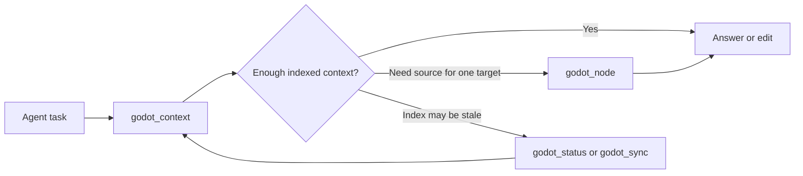

# Agent Output Reference

This document describes the compact graph output used by the MCP tools. It is for maintainers and agents that need to understand how `gdgraph` returns indexed Godot context without falling back to broad file scans.

## System Overview

`gdgraph` indexes Godot scripts, scenes, resources, signals, node paths, and graph relationships before an agent asks a question. The MCP surface then returns compact, ranked context that is meant to be read directly by an agent.

The intended flow is:



Broad `grep` or raw file reads are not the default path for indexed Godot files. They are reserved for unindexed files, stale files named by the response, and external validation such as tests or compiler output.

## Directory Structure

The agent-facing output is implemented in these modules:

| Path | Responsibility |
| --- | --- |
| `src/context/agent-output.ts` | Formats graph context into compact node, path, relationship, snippet, budget, and omitted-count fields. |
| `src/context/explore.ts` | Builds ranked `godot_context` input from search, graph neighbors, source snippets, path links, and optional blast-radius data. |
| `src/context/node-payload.ts` | Builds exact `godot_node` reads for files, symbols, and graph node ids. |
| `src/mcp/tools.ts` | Defines the MCP surface and adapts status, context, node, and sync payloads to compact JSON. |
| `src/db/queries.ts` | Provides graph node/file lookup, search token handling, relationship rows, and symbol-reference data. |

Public fixtures and temporary synthetic projects are used for tests. Documentation and tests must not copy private project code, private project names, absolute local paths, or private Godot assets.

## Tool Surface

The default MCP tools are intentionally small:

| Tool | Purpose |
| --- | --- |
| `godot_status` | Returns graph initialization, counts, and freshness health. |
| `godot_context` | Primary first call for understanding, locating, flow tracing, and edit planning. |
| `godot_node` | Graph-backed source read for one indexed file, symbol, or graph node id. |
| `godot_sync` | Manual recovery when the index needs to catch up. |

## Compact Context Format

`formatAgentContext()` returns a bounded context object:

```json
{
  "query": "FixtureActor",
  "prefixes": { "@p1": "res://scripts/ui/" },
  "paths": { "p1": "@p1/fixture_actor.gd" },
  "entryPoints": ["n1"],
  "pathsBetween": [
    { "from": "n1", "kind": "calls", "to": "n2", "provenance": "resolver" }
  ],
  "nodes": [
    {
      "id": "n1",
      "graphId": "script:res://scripts/ui/fixture_actor.gd",
      "kind": "script_class",
      "name": "FixtureActor",
      "path": "p1",
      "line": 2
    }
  ],
  "relationships": [],
  "snippets": [
    { "path": "p1", "start": 2, "end": 18, "text": "..." }
  ],
  "truncated": false,
  "omitted": { "nodes": 0, "relationships": 0, "snippets": 0 },
  "budget": { "maxChars": 4800, "estimatedChars": 1200 }
}
```

`paths` stores each returned Godot path once. Nodes, snippets, blast-radius check files, and scene summaries refer back to these short ids. When several paths share a long directory prefix, `prefixes` can replace that shared prefix with an alias such as `@p1`.

`id` is a response-local compact node id. `graphId` is the stable indexed graph id and can be passed to `godot_node`.

## Relationship Format

Relationships are structured objects rather than repeated prose strings:

```json
{ "from": "n1", "kind": "calls", "to": "n2", "provenance": "resolver" }
```

When either side of an edge is outside the visible node set, the formatter keeps the graph id in `graphFrom` or `graphTo`. Unresolved references keep `target` so agents can see what name was not resolved.

`references_symbol` means a source node names or reads a target symbol. It is separate from `calls` and should not be treated as executable flow.

## Source Reads

`godot_context` can include snippets, but it is optimized for orientation and edit planning. Use `godot_node` when source for one target is needed.

Write `godot_context.query` as a short keyword and identifier string. Prefer exact class names, method names, constants, fields, resource paths, file/path fragments, and domain nouns. Avoid natural-language task wording such as `find`, `include paths`, `summarize`, `relevant for`, or `tell me`.

Resource nodes include `.tres` property metadata. For resource-heavy tasks, query with path fragments and concrete property names or literal values. Treat returned resource matches as ranked navigation evidence, not proof that every matching resource has been listed.

`godot_node` supports three target modes:

```json
{ "file": "res://scripts/fixture_actor.gd", "offset": 1, "limit": 80 }
```

```json
{ "symbol": "FixtureActor" }
```

```json
{ "id": "script:res://scripts/fixture_actor.gd" }
```

File reads return a bounded line window. Symbol and graph-node reads prefer indexed `startLine` and `endLine`, so method and class queries return relevant source instead of the start of a file. `symbolsOnly: true` returns structure without source text. `includeCode: false` keeps metadata and relationship notes while omitting source. Relationship notes are bounded; use `notes.omitted` to tell whether more relationships exist outside the response.

For constants, enums, signal names, resource paths, or string protocols, graph navigation should be followed by a narrow `rg` or test check when complete reference proof matters.

## Missing Index Recovery

`godot_context` and other graph-backed tools do not silently create an index for arbitrary `projectPath` values. When a new worktree, copied project, or empty graph returns `initialized:false` or `indexEmpty:true`, call `godot_sync` manually once for that project path, then retry the original graph query.

Missing-index payloads include `nextTools` guidance so agents can treat this as a normal setup step instead of a terminal query failure.

## Budgets And Truncation

Agent output uses hard response budgets to avoid large payloads:

| Response kind | Default budget |
| --- | --- |
| `godot_context` | `4800` estimated JSON characters |

When a payload exceeds its budget, lower-priority snippets are dropped first, then relationships, then nodes. The response sets `truncated: true` and increments `omitted` counts so an agent can decide whether to ask a narrower graph question.

## Freshness Contract

Graph-backed answers include freshness metadata. If a selected indexed file has pending watcher or sync work, responses add `stale: true` and `staleFiles`. Agents should either run `godot_sync` or inspect only the named stale files before treating that response as final.

`godot_sync` returns graph-index delta counts. `addedCount`, `modifiedCount`, and `deletedCount` describe indexed Godot files, not Git status. Path lists are omitted by default to keep agent output compact.

## Privacy And Fixture Rules

Open-source examples must use generic names such as `FixtureActor`, `SamplePanel`, `ExampleEntry`, or temporary synthetic projects. They must not include:

- private project names;
- absolute local user paths;
- proprietary Godot script, scene, resource, or asset content;
- business-domain terms copied from a private game;
- historical implementation plans that are no longer part of the maintained technical reference.

Use privacy scans and hash comparison against local private project roots before publishing release artifacts or force-pushed history.
